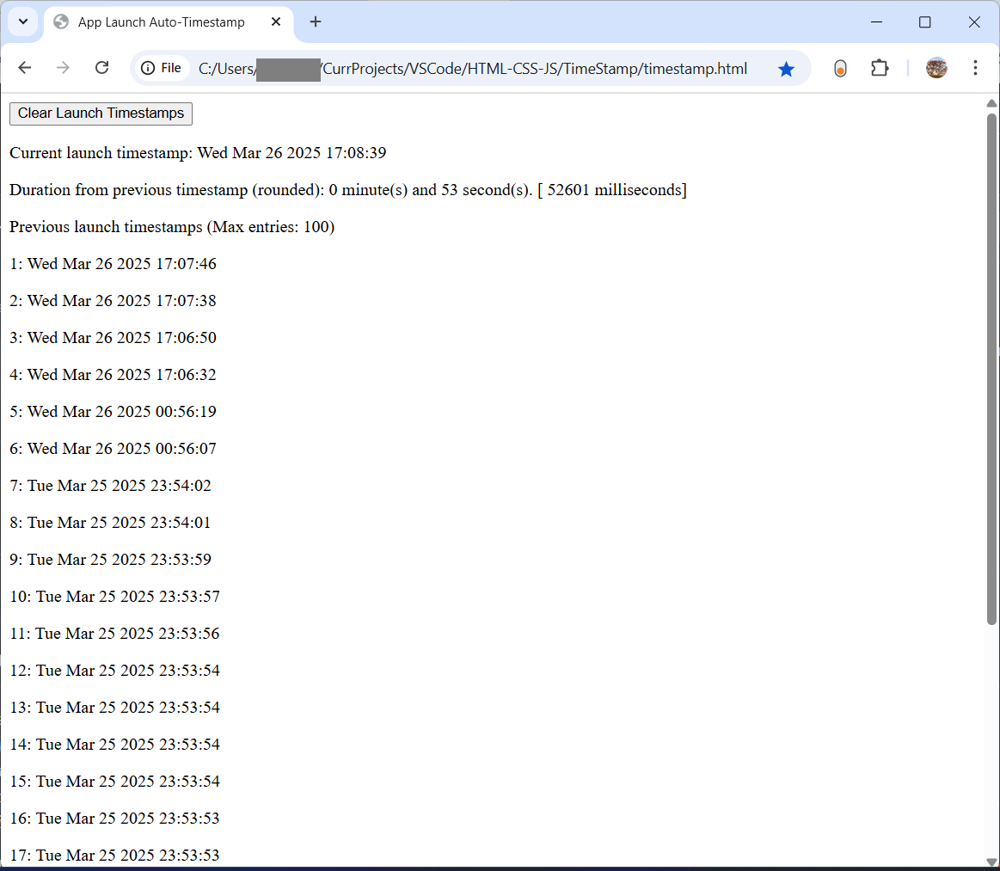

# Very Simple Launch and Refresh Timestamp Recorder Web App

This is a very simple launch/refresh timestamp recorder web app implemented as one single HTML file with JavaScript code in it. It will automatically create a timestamp (with no text associated with it) when the app is launched. The app will display a hardcoded maximum number of previous timestamps. It also has a button to clear the timestamps. I have added showing of duration between current timestamp and immediately previous timestamp.  

This web app is useful on PC to quickly and easily record timestamps and also to capture typically small break duration or even small task duration. To use it, just open the HTML file in a browser (I have used it and tested it mainly, if not only, on Chrome). To add a timestamp on the open HTML page, simply refresh the page. I usually keep the HTML file open in a browser tab to make it easy to quickly access it and record a timestamp by clicking on refresh button.

For Android mobile, I have an Android app (written in Kotlin): [Very Simple Launch and One-Touch-Add Timestamp Recorder Android App](https://raviswdev.blogspot.com/2025/02/very-simple-one-touch-timestamp-on.html). On Android mobile, the Android app is much faster than this repo's web app as first a browser app has to be loaded and then this web app has to run within the browser. On mobile, if the browser app is already open, this web app is also quite fast.  

The background to this app is that I needed such a one-touch app on my Android phone (Samsung). In my limited search on Play Store, I could not get a free Timestamp app that does what I want as a one-touch operation. One app I tried needed three touches - to launch the app, to initiate adding a timestamp and finally a third touch to create the timestamp (with empty text). At that time around Dec. 2024, I had almost no exposure to Android programming and so chose to write this web app. Now I rarely use this web app on mobile and prefer to use above mentioned Android app on mobile. But I regularly use this web app on PC.

To setup this web app on mobile:
1) Copy the timestamp.html file to mobile (say via Gmail).
2) Move the timestamp.html file to a suitable folder on mobile (e.g. MyWebApps)
3) Open file in mobile Chrome (or perhaps other browser but I have tested it only on Chrome).
4) The app will run and show current timestamp. Later invocations of app will show previous launch timestamps.
5) To add a new timestamp on the open page, refresh the page.
6) To make the app easily accessible, add the timestamp.html file to Home screen.
7) You can also then add the Home screen file to Bottom Quick Launch (5 apps max on my Samsung Android phone).
8) Now it will be a one-touch (launch) timestamp recording mechanism (in browser Local Storage).
